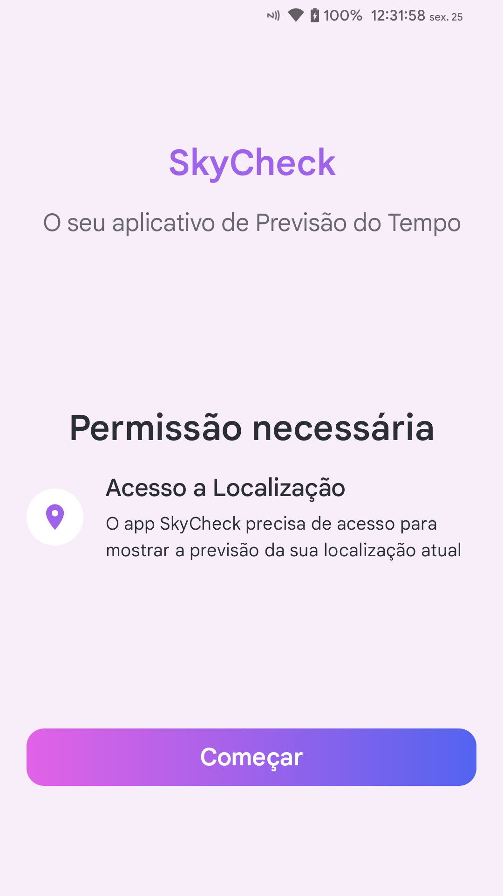
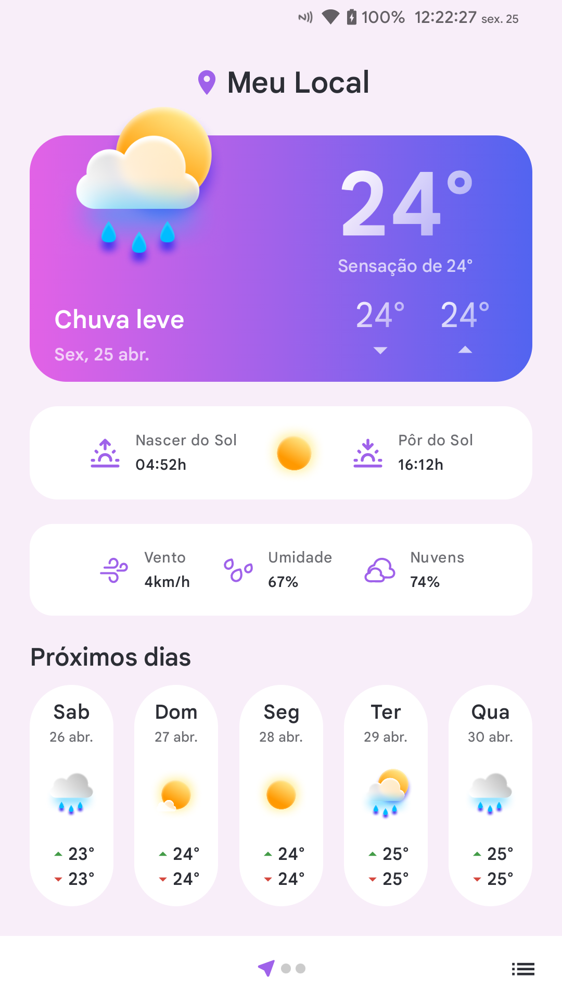
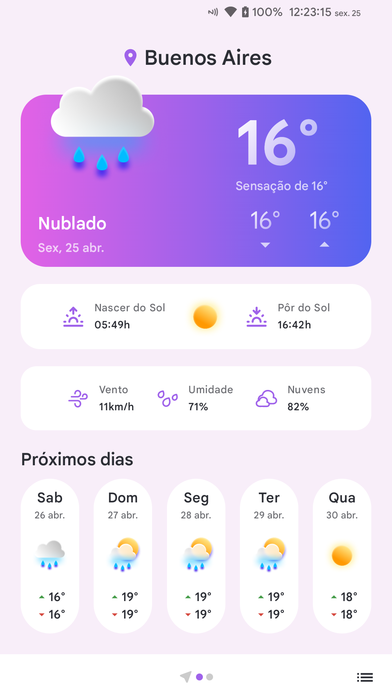
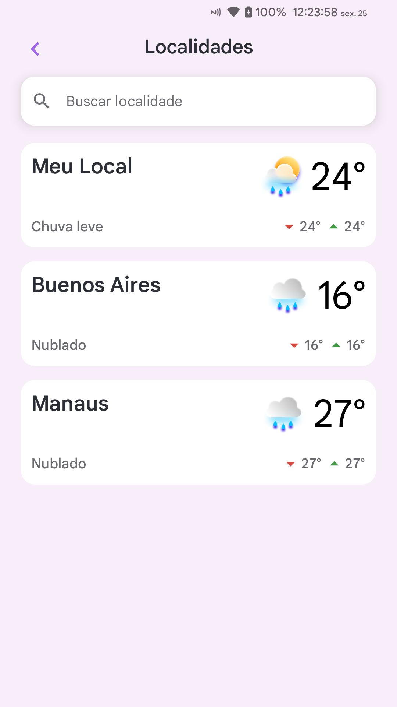
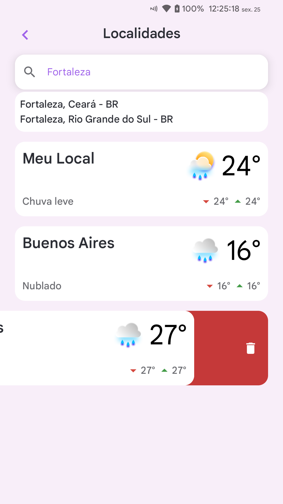

# SkyCheck
Aplicativo Android de Previsão do Tempo

### Objetivo
Visualizar informações da previsão do tempo atual e dos próximos dias para a localização atual e/ou qualquer outra localização

### Funcionalidades
- Fornecer localização atual do dispositivo
- Adicionar localidade
- Remover localidade
- Manter as informações em cache

### Linguagem / Tecnologia utilizada
- Kotlin - Jetpack Compose
- Room Database

### Serviço externo
API OpenWeatherMap

### Screenshots
    
